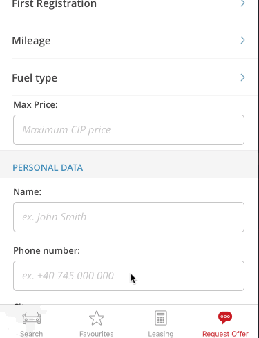
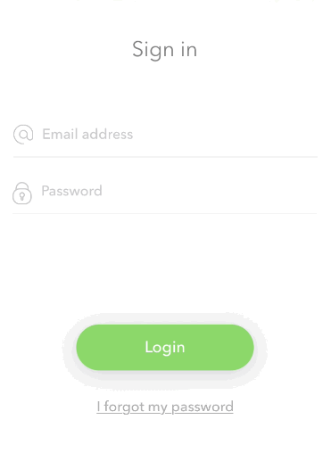

# TTInputVisibilityController


[](http://twitter.com/Tapptitude)

## About
Lightweight controller to keep your inputs visible when the keyboard is presented.

This project is maintained by Tapptitude, a mobile app development agency specialized in building high-quality iOS and Android mobile apps, for startups and brands alike. A lively team of skilled app developers and app designers based in Europe, we provide full-stack mobile app development services to entrepreneurs looking to innovate on mobile. 

<br/><br/><br/>



## Features:
- Lightweight & very easy to integrate
- Works with any inputs or keyboard types
- Automatic keyboard dismiss when tapping outside of the input
- Ignore views that trigger dimissal 
- Custom additional distance from the keyboard 
- Add any view to be visible
- Custom animation block when the keyboard is presented.

## Requirements

- iOS 8.0+
- Xcode 7.3+

## Installation

_CocoaPods_

_Swift 4.0, 3.X_

```ruby
pod 'TTInputVisibilityController'
```

_Carthage_

```
github "tapptitude/TTInputVisibilityController"
```

_Manually_

Add the contents of TTInputVisibilityController files to your project.

## Usage

### Add the controller directly to your view

You can add the keyboardVisibilityController to the view property of any ViewController. 

```swift
override func viewDidLoad() {
    super.viewDidLoad()
    self.view.addInputVisibilityController()
}
```
### Custom space above the keyboard

You can add extra space above the keyboard by setting the  ```swift extraSpaceAboveKeyboard``` property. 

### Ignore views that trigger dimissal

If you want some view to not trigger the dismissal of the keyboard(e.g. a login button) you can set

```swift 
inputVisibilityController.dismissKeyboardTouchRecognizer?.ignoreViews = [myLoginButton] 
```

### Additional animation block

You can also provide a block to be called when the keyboard is dismissed or presented, providing you the translation value. (e.g animating some constraints)

```swift 

inputVisibilityController.additionallAnimatioBlock = { [weak self] translation in
    self?.loginButtonBottomConstraint.constant = initialConstraint + translation
    self?.view.layoutIfNeeded()
}

```

## Contribution

Feel free to Fork, submit Pull Requests or send us your feedback and suggestions!


## License

TTInputVisibilityController is available under the MIT license. See the LICENSE file for more info.
